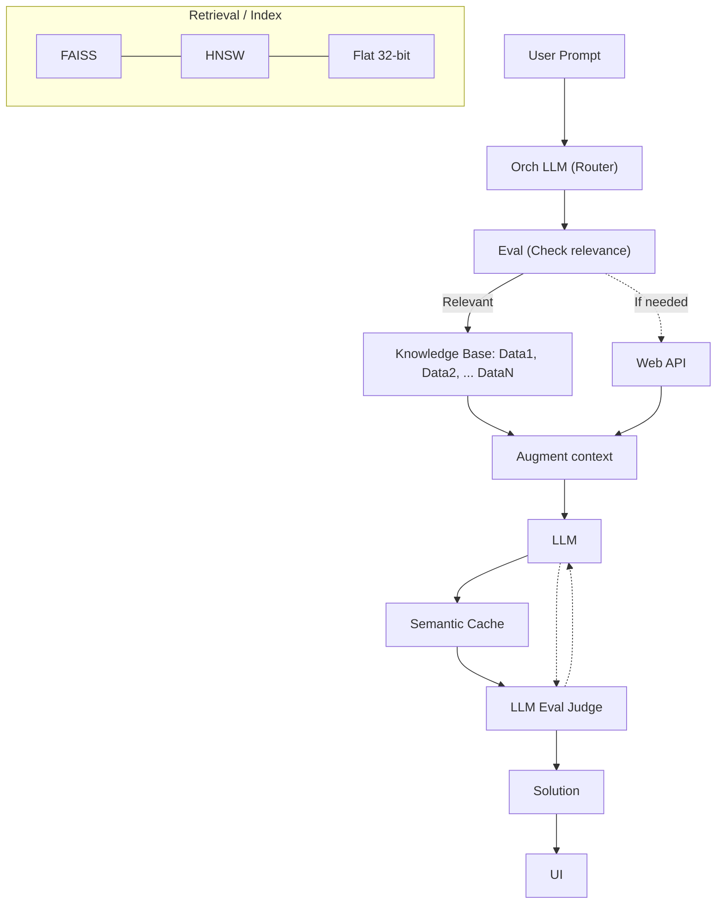

```mermaid
flowchart TD
  U["User Prompt"] --> R["Orch LLM (Router)"]

  subgraph RET["Retrieval / Index"]
    F["FAISS"] --- H["HNSW"]
    H --- Q["Flat 32-bit"]
  end

  R --> E["Eval (Check relevance)"]
  E -->|Relevant| KB["Knowledge Base: Data1, Data2, ... DataN"]
  E -.->|If needed| W["Web API"]

  KB --> A["Augment context"]
  W --> A
  A --> L["LLM"]

  %% Main vertical flow
  L --> C["Semantic Cache"]
  C --> J["LLM Eval Judge"]

  %% Extra arrows (one down, one up) directly between LLM and Judge
  L -.-> J
  J -.-> L

  J --> S["Solution"]
  S --> UI["UI"]
```
