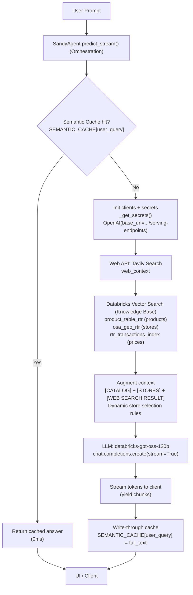

```mermaid
flowchart TD
  U["User Prompt"] --> A["SandyAgent.predict_stream() (Orchestration)"]

  %% 1) Cache decision
  A --> C{"Semantic Cache hit?<br/>SEMANTIC_CACHE[user_query]"}
  C -->|Yes| OUT["Return cached answer<br/>(0ms)"]
  OUT --> UI["UI / Client"]

  %% 2) Setup + secrets
  C -->|No| INIT["Init clients + secrets<br/>_get_secrets()<br/>OpenAI(base_url=.../serving-endpoints)"]

  %% 3) Web research (Tavily)
  INIT --> WEB["Web API: Tavily Search<br/>web_context"]

  %% 4) Vector Search knowledge bases
  WEB --> KB["Databricks Vector Search (Knowledge Base)<br/>product_table_rtr (products)<br/>osa_geo_rtr (stores)<br/>rtr_transactions_index (prices)"]

  %% 5) Dynamic store resolution + context building
  KB --> AUG["Augment context<br/>[CATALOG] + [STORES] + [WEB SEARCH RESULT]<br/>Dynamic store selection rules"]

  %% 6) LLM generation
  AUG --> LLM["LLM: databricks-gpt-oss-120b<br/>chat.completions.create(stream=True)"]

  %% 7) Stream to UI + write cache
  LLM --> STREAM["Stream tokens to client<br/>(yield chunks)"]
  STREAM --> SAVE["Write-through cache<br/>SEMANTIC_CACHE[user_query] = full_text"]
  SAVE --> UI
```
