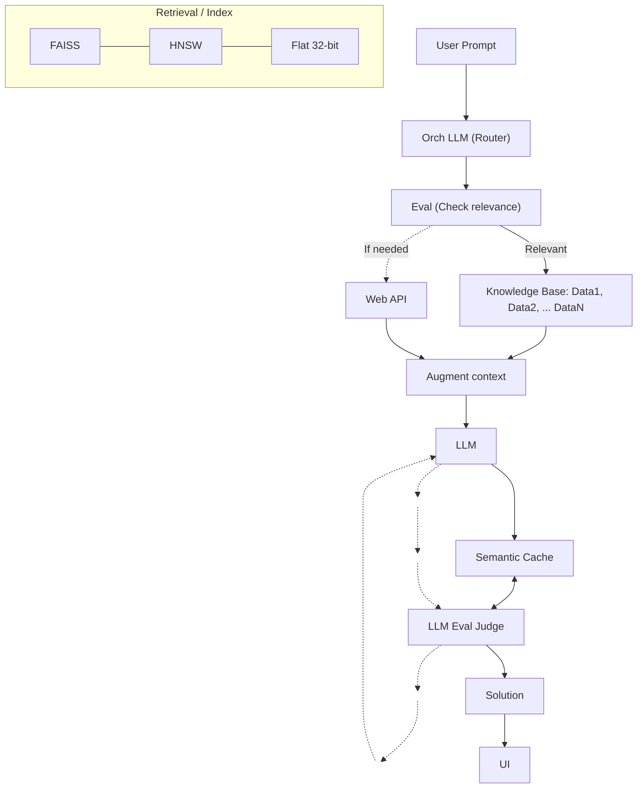

```mermaid
flowchart TD
  U["User Prompt"] --> R["Orch LLM (Router)"]

  subgraph RET["Retrieval / Index"]
    F["FAISS"] --- H["HNSW"]
    H --- Q["Flat 32-bit"]
  end

  R --> E["Eval (Check relevance)"]
  E -->|Relevant| KB["Knowledge Base: Data1, Data2, ... DataN"]
  E -.->|If needed| W["Web API"]

  KB --> A["Augment context"]
  W --> A
  A --> L["LLM"]

  L --> C["Semantic Cache"]
  C <--> J["LLM Eval Judge"]

  %% invisible anchors to route lines around Semantic Cache
  R1(( )):::invis
  R2(( )):::invis
  L1(( )):::invis
  L2(( )):::invis

  %% right-side bypass: LLM -> Judge (go around to the right)
  L -.-> R1 -.-> R2 -.-> J

  %% left-side bypass: Judge -> LLM (go around to the left)
  J -.-> L1 -.-> L2 -.-> L

  J --> S["Solution"]
  S --> UI["UI"]

  classDef invis fill:transparent,stroke:transparent,color:transparent;
```
