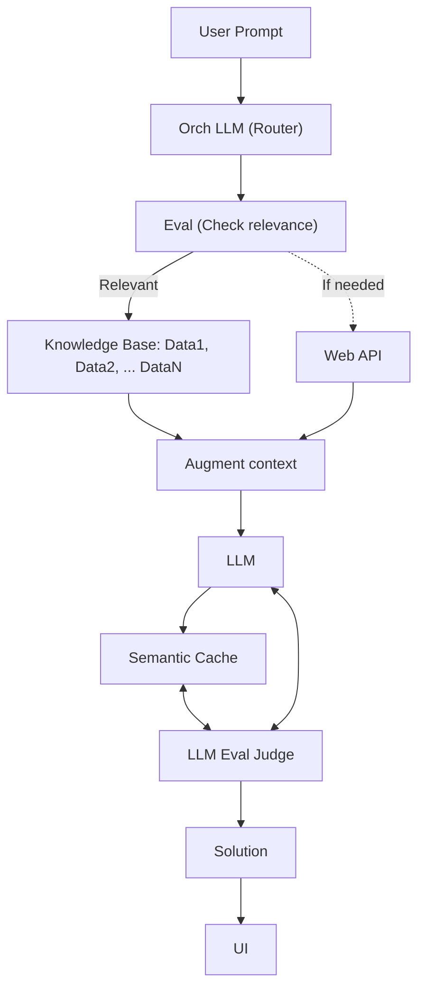

```mermaid
flowchart TD
  U["User Prompt"] --> R["Orch LLM (Router)"]

  R --> E["Eval (Check relevance)"]
  E -->|Relevant| KB["Knowledge Base: Data1, Data2, ... DataN"]
  E -.->|If needed| W["Web API"]

  KB --> A["Augment context"]
  W --> A
  A --> L["LLM"]

  L --> C["Semantic Cache"]

  %% Semantic Cache <-> Judge
  C <--> J["LLM Eval Judge"]

  %% LLM <-> Judge
  L <--> J

  J --> S["Solution"]
  S --> UI["UI"]
```
